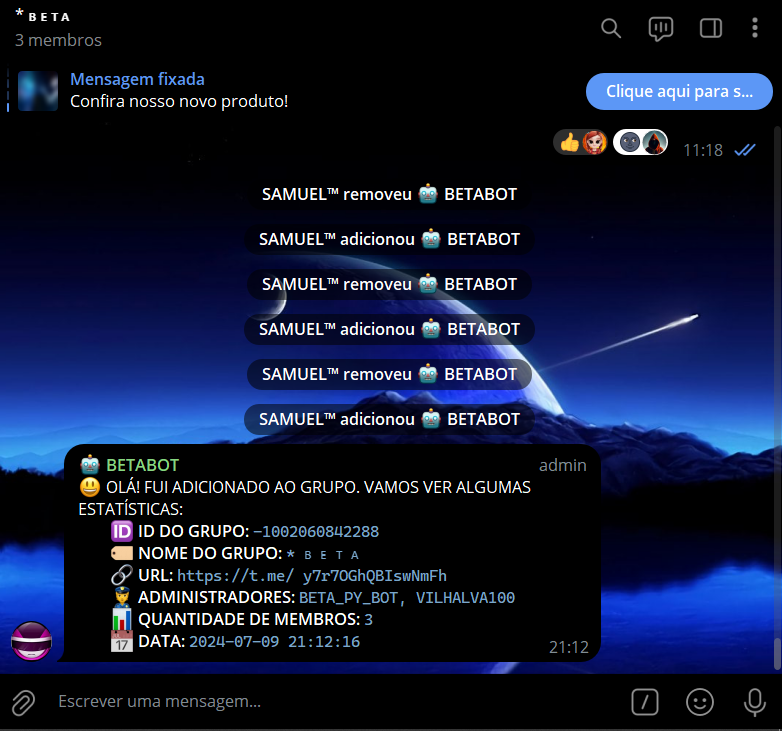
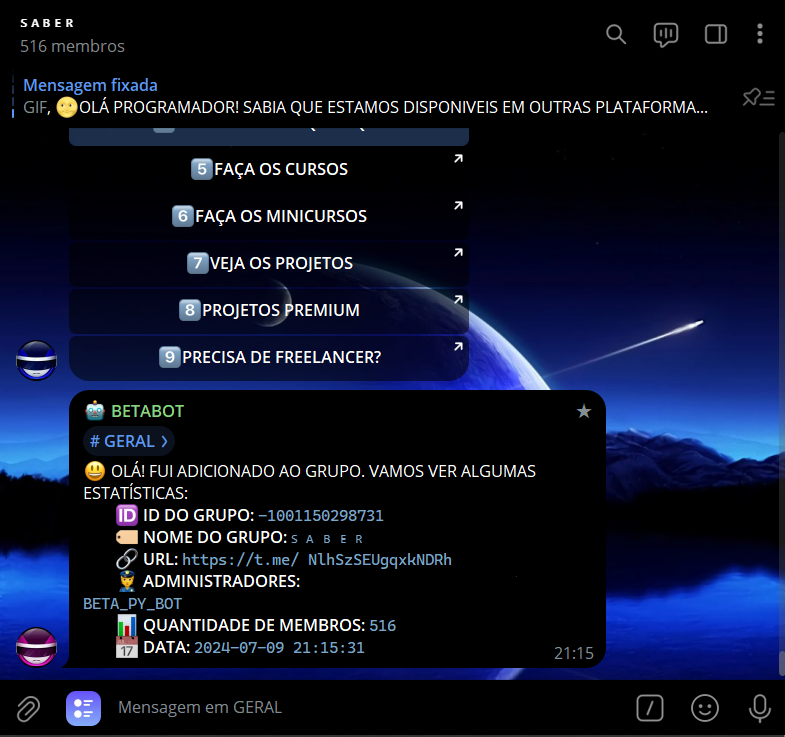

# ESTATISTICAS DO GRUPO
🤤ESSE É UM BOT DO TELEGRAM QUE EXIBE AS ESTATISTICAS DO GRUPO QUANDO É ADICIONADO!

 <br>
 <br>

## AVISO:
Até a data de lançamento deste bot (09/07/2024), o aplicativo oficial do Telegram não oferece uma função nativa que permita aos usuários descobrir o ID de algum grupo ou canal. Aqueles que conseguem realizar essa tarefa geralmente utilizam clientes personalizados do Telegram que disponibilizam tal recurso ou contam com a assistência de bots especializados. Foi com o intuito de preencher essa lacuna que desenvolvi a minha própria versão simplificada desse recurso. Mesmo que o Telegram venha a incorporar essa funcionalidade em futuras atualizações, manterei este bot ativo aqui no [GITHUB](https://github.com/VILHALVA?tab=repositories&q=+topic:BOT) como uma alternativa prática e acessível.

## DESCRIÇÃO:
Este bot para Telegram foi projetado para fornecer informações detalhadas sobre um grupo assim que for adicionado ao mesmo. Suas principais funcionalidades incluem exibir o ID do grupo, nome do grupo, URL do grupo, lista de administradores, quantidade de membros e a data atual. Tudo isso é apresentado em uma mensagem formatada de forma que os usuários possam facilmente copiar as informações.

## UTLILIDADE:
Este bot é útil para fornecer informações detalhadas sobre um grupo no Telegram de forma automática. Com ele, você pode rapidamente acessar o ID do grupo, nome, URL, administradores e quantidade de membros, tudo em um formato fácil de copiar e compartilhar.

## FUNCIONALIDADES:
1. **Identificação do Grupo:** Obtém e exibe o ID do grupo e o nome do grupo.
2. **URL do Grupo:** Se disponível, exibe o link de convite do grupo.
3. **Administradores:** Lista os usernames dos administradores do grupo.
4. **Quantidade de Membros:** Mostra a quantidade total de membros do grupo.
5. **Data Atual:** Exibe a data e hora atuais no momento em que o bot é adicionado ao grupo.

## EXECUTANDO O PROJETO:
1. **Coloque o Token:**
   - Antes de executar o programa, é necessário substituir o token do seu bot no arquivo `TOKEN.py`, o qual pode ser obtido por meio do [@BotFather](https://t.me/BotFather).

2. **Instalando as dependências:**
   - Antes de executar o bot, certifique-se de instalar todas as dependências necessárias. No terminal, execute o seguinte comando para instalar as dependências listadas no arquivo `requirements.txt` em `CODIGO`:
   ```bash
   pip install -r requirements.txt
   ```

3. **Inicie o Bot:**
   - Execute o bot do Telegram em Python iniciando-o com o seguinte comando:
   ```bash
   python CODIGO.py
   ```

4. **Adicionando o Bot ao Grupo:**
   - Adicione o bot como Administrador no grupo no Telegram.
   - Assim que o bot for adicionado, ele enviará automaticamente uma mensagem no grupo com as informações detalhadas, formatadas para fácil cópia.

## NÃO SABE?
- Entendemos que para manipular arquivos em muitas linguagens e tecnologias relacionadas, é necessário possuir conhecimento nessas áreas. Para auxiliar nesse aprendizado, oferecemos alguns subsidios:
* [VEJA A DOCUMENTAÇÃO](https://core.telegram.org/bots/api)
* [CURSO DE PYTHON](https://github.com/VILHALVA/CURSO-DE-PYTHON)
* [CURSO SUGERIDO](https://github.com/VILHALVA/CURSO-DE-TELEBOT)
* [CONFIRA MAIS CURSOS](https://github.com/VILHALVA?tab=repositories&q=+topic:CURSO)

## CREDITOS:
- [PROJETO BASEADO NO "BUSCADOR DE ID"](https://github.com/VILHALVA/BUSCADOR-DE-ID)
- [PROJETO FEITO PELO VILHALVA](https://github.com/VILHALVA)
